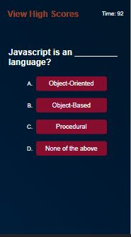

# Code-quizzer

## Description

This mobile-first website provides a quiz genereated with JavaScript. The project contains only one html file, every page in the browser display is created dinamically through Java Script.

The user can take a quiz about Java Script concepts. The background will flash either green or red, depending on whether he chose the correct or the incorrect answer correspondingly.

Once the quiz starts, a timer starts running from  100-0.
When the timer reaches 10, it changes color to red to alert user that time is running out
If time reaches 0 it stops and quiz finishes

The user's score is automatically saved to local storage. User can input his name to save as well.

The score data from local storage is then gathered and displayed in the browser.
User can either return to the main page and take the quiz, or they can clear the highscore section

User will not be able to see the highscore sections unless there is data saved in local storage

Project also employes an animation to give the illusion of changing background colors through the use of gradients

## Screenshots

## Links

### Website Link
https://jorge30fm.github.io/Code-quizzer/

### Github Repositpory Link
https://github.com/jorge30fm

